# 🎯 Questly

> **Turn Your Goals Into Quests.**

Questly คือ Web Application สำหรับสร้าง เข้าร่วม และจัดการภารกิจ (Quest) โดยผู้ใช้สามารถค้นหา Quest ที่สนใจ รับ Quest ทำภารกิจตาม Todo ติดตามความคืบหน้า และรับรางวัลเป็น QC เมื่อทำ Quest สำเร็จ

โปรเจกต์นี้พัฒนาด้วย **Next.js, React, TypeScript และ Material UI (MUI)** โดยออกแบบให้รองรับการใช้งานทั้ง Desktop และ Mobile

---

# 📌 สถานะปัจจุบันของระบบ

> **สถานะ ณ ปัจจุบัน**

ระบบหลักของ Questly สามารถใช้งานได้แล้วในส่วนของการจัดการ Quest, Todo, Progress, Reward, Wallet และ Profile โดยใช้ `localStorage` เป็นพื้นที่จัดเก็บข้อมูล

### ✅ ระบบที่มีแล้ว

* [x] Home
* [x] Navbar
* [x] แสดง Quest
* [x] แสดง Recommended Quest
* [x] แสดง Quest 3 รายการต่อหน้า
* [x] ปุ่ม Next สำหรับดู Quest ชุดถัดไป
* [x] Quest List
* [x] Quest Search
* [x] Quest Detail
* [x] Create Quest
* [x] Accept Quest
* [x] Todo
* [x] Progress
* [x] Quest Status
* [x] Complete Quest
* [x] Claim Reward
* [x] QC
* [x] Wallet
* [x] Coin Transaction
* [x] My Quests
* [x] Profile
* [x] เปลี่ยนชื่อ Profile
* [x] Avatar ตามตัวอักษรแรกของชื่อ
* [x] Delete Quest ของเจ้าของ
* [x] React Hooks
* [x] Custom Hook `useQuests`
* [x] LocalStorage
* [x] Responsive Design

### ⚠️ ระบบที่ยังไม่มี / ยังไม่สมบูรณ์

* [ ] Login / Register จริง
* [ ] Database จริง
* [ ] Backend Server / API จริง
* [ ] ระบบ Admin
* [ ] ระบบ Online Multiplayer
* [ ] ระบบ Chat
* [ ] ระบบ Notification
* [ ] ระบบหัก QC จากผู้สร้าง Quest เพื่อเป็นกองกลาง Reward
* [ ] ระบบโอน QC ระหว่างผู้ใช้แบบ Server-side
* [ ] Authentication และ Authorization แบบ Backend

> ระบบปัจจุบันเป็น Prototype / Frontend Application ที่ใช้ LocalStorage เพื่อจำลองการจัดเก็บข้อมูลและการทำงานของระบบ

---

# 🏷️ ที่มาของชื่อ Questly

ชื่อ **Questly** มาจากคำว่า **Quest** ซึ่งหมายถึงภารกิจ เป้าหมาย หรือสิ่งที่ต้องทำให้สำเร็จ

ส่วน **“ly”** ถูกนำมาใช้เพื่อทำให้ชื่อมีความกระชับ ทันสมัย และเหมาะกับการเป็นชื่อ Web Application

แนวคิดของชื่อ Questly จึงสื่อถึงแอปพลิเคชันที่ช่วยเปลี่ยนเป้าหมายหรือกิจกรรมต่าง ๆ ให้กลายเป็น Quest ที่ผู้ใช้สามารถเข้าร่วมและทำให้สำเร็จได้

แนวคิดหลักของชื่อจึงสอดคล้องกับคำว่า

> **Turn Your Goals Into Quests.**

หรือ

> **เปลี่ยนเป้าหมายของคุณให้กลายเป็นภารกิจ**

---

# 📖 ที่มาและแนวคิดของโครงงาน

Questly ได้รับแนวคิดจากการศึกษาแอปพลิเคชัน **Trigr** ซึ่งมีแนวคิดเกี่ยวกับการสร้างและเข้าร่วม Mission รวมถึงการทำกิจกรรมให้สำเร็จ

กลุ่มได้นำแนวคิดดังกล่าวมาวิเคราะห์และพัฒนาเป็น Web Application ของตนเอง โดยเปลี่ยนแนวคิด Mission ให้เป็น Quest และเพิ่มระบบ Todo, Progress และ QC Reward

ระบบจึงถูกออกแบบให้ผู้ใช้สามารถ

```text
สร้าง Quest
    ↓
ให้ผู้ใช้อื่นเข้าร่วม
    ↓
ทำภารกิจ
    ↓
ติดตาม Progress
    ↓
ทำ Quest สำเร็จ
    ↓
รับ QC Reward
```

---

# 🔎 การวิเคราะห์แนวคิดจาก Trigr

แนวคิดที่นำมาประยุกต์ใช้ ได้แก่

* การสร้างภารกิจ
* การเข้าร่วมภารกิจ
* การแบ่งภารกิจเป็นขั้นตอน
* การติดตามความคืบหน้า
* การแสดงสถานะของภารกิจ
* การสร้างแรงจูงใจผ่าน Reward

Questly นำแนวคิดเหล่านี้มาพัฒนาให้เหมาะกับ Web Application และเพิ่มระบบจัดการ Quest, Todo, Progress, QC และ Profile

---

# 🎯 วัตถุประสงค์

1. เพื่อพัฒนา Web Application สำหรับจัดการ Quest
2. เพื่อให้ผู้ใช้สามารถสร้างและเข้าร่วม Quest
3. เพื่อให้ผู้ใช้สามารถติดตามความคืบหน้าของ Quest
4. เพื่อสร้างแรงจูงใจผ่านระบบ QC Reward
5. เพื่อให้ผู้ใช้สามารถจัดการ Quest ของตนเอง
6. เพื่อฝึกการพัฒนา Web Application ด้วย Next.js
7. เพื่อประยุกต์ใช้ React Hooks และ Component-based Development
8. เพื่อออกแบบระบบที่รองรับ Responsive Design

---

# 🧩 ขอบเขตของระบบ

ระบบแบ่งออกเป็นส่วนหลักดังนี้

```text
Questly
│
├── Home
├── Quests
├── Quest Detail
├── Create Quest
├── My Quests
├── Wallet
└── Profile
```

---

# 🌐 โครงสร้างหน้าแอป

| หน้า         | URL             | หน้าที่                  |
| ------------ | --------------- | ------------------------ |
| Home         | `/`             | หน้าแรกและ Quest แนะนำ   |
| Quests       | `/quests`       | ค้นหาและดู Quest         |
| Quest Detail | `/quests/[id]`  | รายละเอียดและการทำ Quest |
| Create Quest | `/create-quest` | สร้าง Quest              |
| My Quests    | `/my-quests`    | ดู Quest ที่เข้าร่วม     |
| Wallet       | `/wallet`       | ดู QC และ Transaction    |
| Profile      | `/profile`      | จัดการข้อมูลผู้ใช้       |

---

# 🏠 Home

หน้า Home เป็นหน้าแรกของระบบ
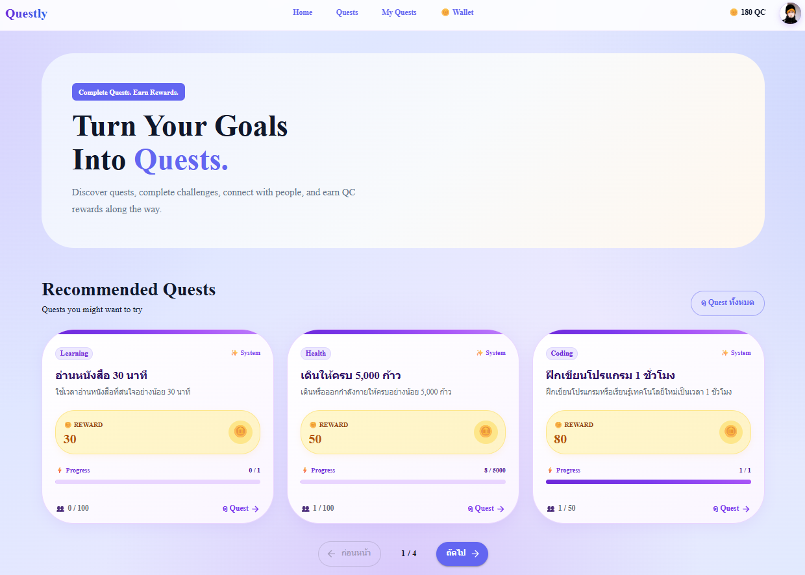

## ฟังก์ชัน

* แสดงชื่อระบบ
* แสดง Hero Section
* แสดง Recommended Quests
* แสดง Quest 3 รายการต่อหน้า
* Next ไปดู Quest ชุดถัดไป
* เลือก Quest เพื่อดูรายละเอียด
* แสดง QC บริเวณ Navbar
* แสดง Profile Avatar

---

# 🔎 Quests

ใช้สำหรับค้นหาและดู Quest ทั้งหมด
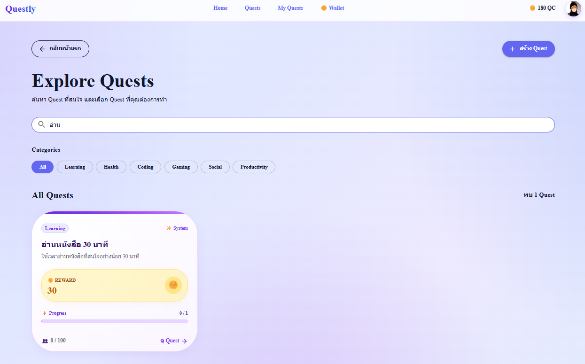

## ฟังก์ชัน

* แสดง Quest
* ค้นหา Quest
* ดู Reward
* ดู Participants
* ดู Creator
* เปิด Quest Detail

---

# 📋 Quest Detail

ใช้สำหรับดูรายละเอียดและทำ Quest
กำลังจะทำการรับเควส
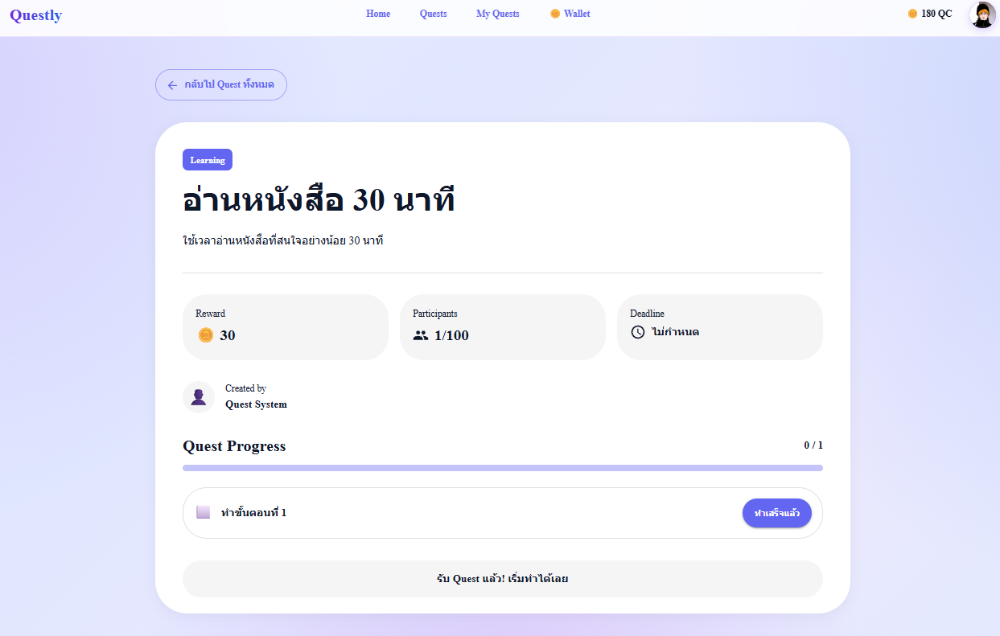
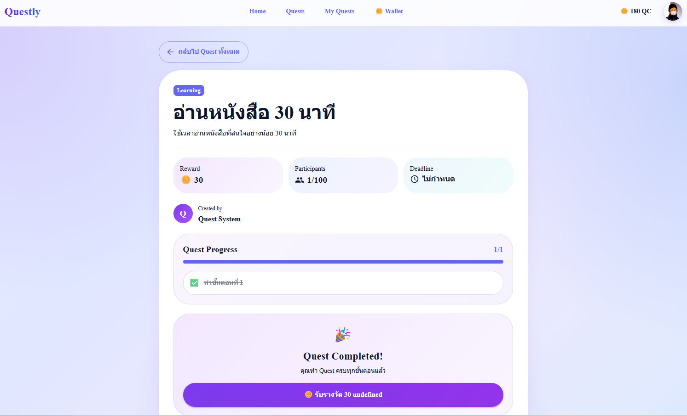
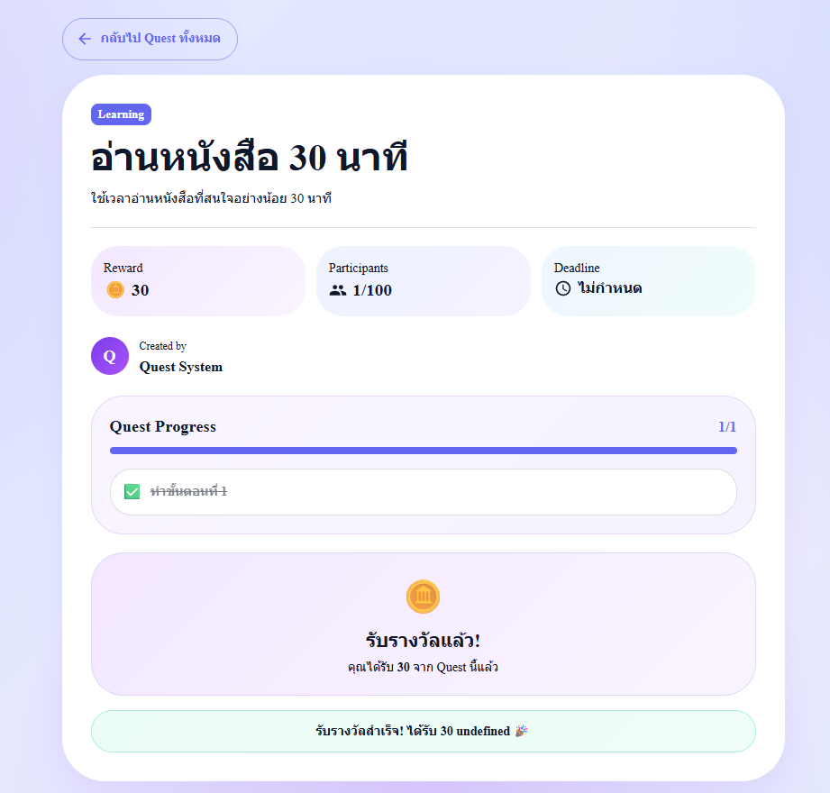
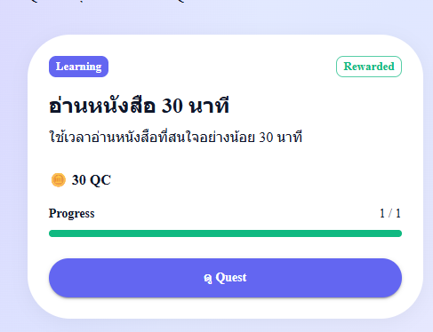
## ฟังก์ชัน

* ดูรายละเอียด Quest
* ดู Creator
* ดู Reward
* ดู Participants
* Accept Quest
* แสดง Todo
* ทำ Todo
* แสดง Progress
* เปลี่ยนสถานะ Quest
* Claim Reward
* ลบ Quest หากเป็นเจ้าของ

---

# ➕ Create Quest
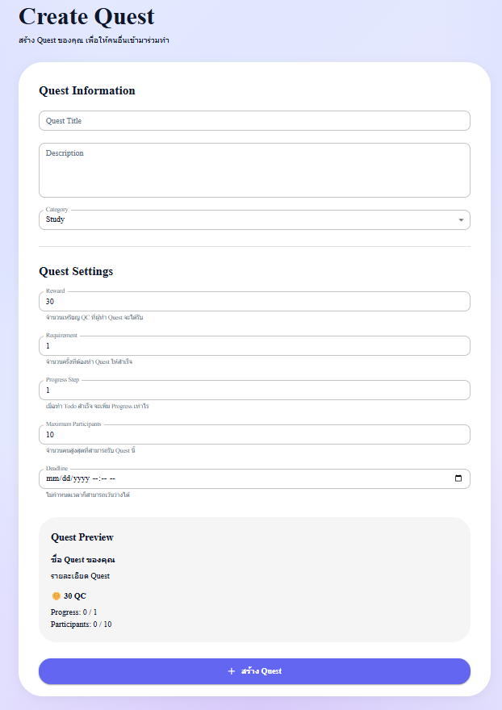
ใช้สร้าง Quest ใหม่

ข้อมูลที่เกี่ยวข้อง ได้แก่

* Title
* Description
* Requirement
* Reward
* Maximum Participants
* Todo

ข้อมูล Quest จะถูกจัดเก็บใน LocalStorage

---

# 📌 My Quests

ใช้สำหรับดู Quest ที่ผู้ใช้เข้าร่วม
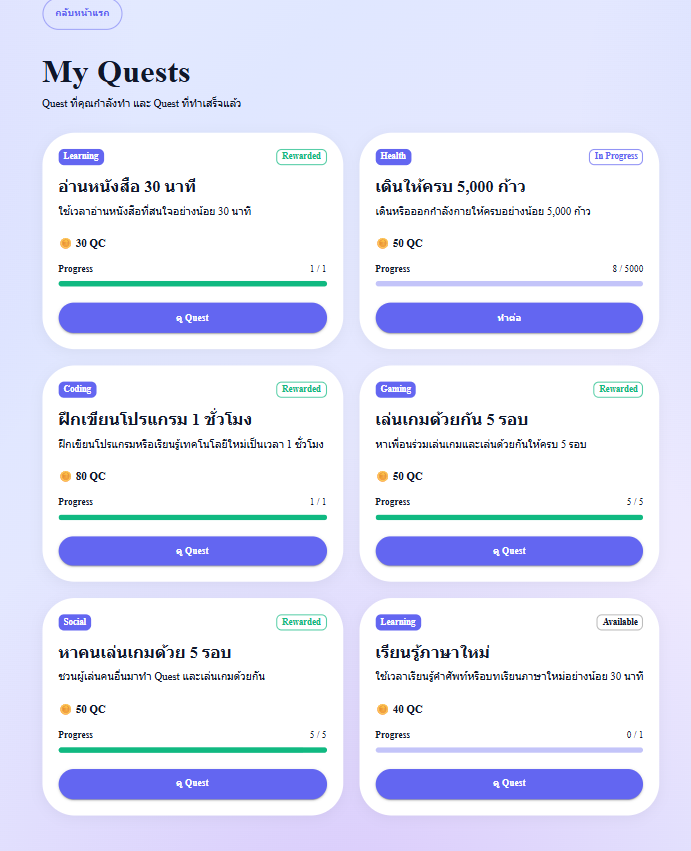

สามารถดูสถานะ เช่น

```text
In Progress
Available
Rewarded
```

และดู Progress ของ Quest ได้

---

# 🪙 Wallet

ใช้สำหรับจัดการ QC
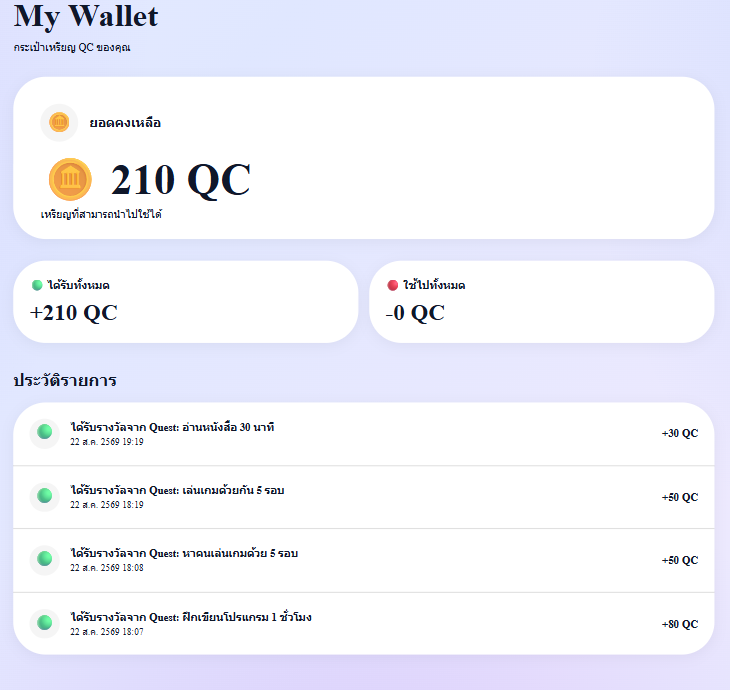

## ฟังก์ชัน

* แสดงจำนวน QC
* แสดง Transaction
* แสดง Reward ที่ได้รับ

ตัวอย่าง

```text
150 QC

+50 QC
Quest Reward

+100 QC
Quest Reward
```

---

# 👤 Profile

ใช้จัดการข้อมูลผู้ใช้
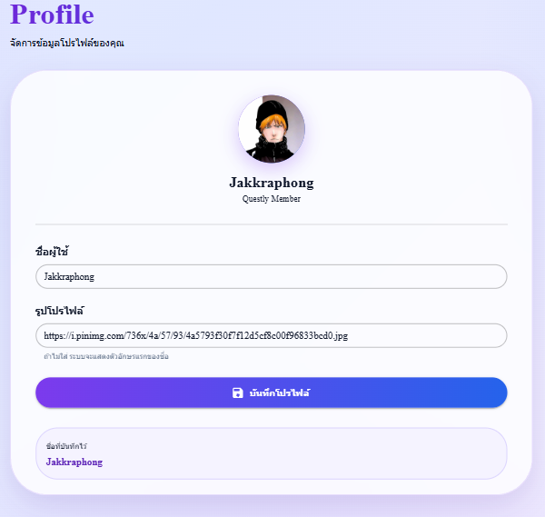

## ฟังก์ชัน

* แสดงชื่อ
* เปลี่ยนชื่อ
* บันทึกชื่อ
* แสดง Avatar
* Avatar เปลี่ยนตามตัวอักษรแรกของชื่อ

ตัวอย่าง

```text
Jakkraphong
     ↓
     J
```

---

# ☑️ ระบบ Todo และ Progress

Quest สามารถประกอบด้วย Todo หลายรายการ

ตัวอย่าง

```text
Quest: Learn Next.js

☐ Learn React
☐ Learn Next.js
☐ Create Page
☐ Connect API
```

เมื่อทำ Todo สำเร็จ ระบบจะเพิ่ม Progress

```text
0 / 4
1 / 4
2 / 4
3 / 4
4 / 4
```

เมื่อ Todo ครบทั้งหมด Quest จะเปลี่ยนเป็น `Completed`

---

# 🔄 Quest Status

ระบบใช้สถานะหลัก

| Status        | ความหมาย          |
| ------------- | ----------------- |
| `available`   | Quest พร้อมให้รับ |
| `in_progress` | กำลังทำ Quest     |
| `completed`   | ทำ Quest สำเร็จ   |
| `rewarded`    | รับ Reward แล้ว   |

---

# 🏆 ระบบ QC Reward

เมื่อทำ Quest สำเร็จ ผู้ใช้สามารถ Claim Reward

ระบบตรวจสอบ

1. Quest ต้องเป็น `completed`
2. Todo ต้องทำครบ
3. Reward ต้องมากกว่า 0
4. Quest ต้องไม่เคย Claim Reward มาก่อน

จากนั้นระบบจะ

```text
Completed
    ↓
Claim Reward
    ↓
เพิ่ม QC
    ↓
สร้าง Transaction
    ↓
Rewarded
```

### ⚠️ ข้อจำกัดปัจจุบัน

ปัจจุบันระบบยัง **ไม่ได้หัก QC ของผู้สร้าง Quest ตอนสร้าง Quest**

ดังนั้น Reward ในเวอร์ชันปัจจุบันเป็นการเพิ่ม QC ให้ผู้ทำ Quest ผ่าน LocalStorage

แนวคิดในอนาคตคือ

```text
ผู้สร้างมี 100 QC
       ↓
สร้าง Quest Reward 30 QC
       ↓
หัก 30 QC
       ↓
ผู้สร้างเหลือ 70 QC
       ↓
ผู้เล่นทำ Quest สำเร็จ
       ↓
ผู้เล่นได้รับ 30 QC
```

ระบบนี้ยังไม่ได้พัฒนาในเวอร์ชันปัจจุบัน

---

# ⚙️ ฟังก์ชันหลังบ้าน

ระบบยังไม่มี Backend Server หรือ Database จริง แต่มีการแยก Business Logic ออกจาก UI

ไฟล์หลักคือ

```text
src/lib/questStorage.ts
```

## Quest Management

```text
getQuests()
saveQuests()
getQuestById()
acceptQuest()
completeTodo()
updateQuestStatus()
getAllQuestProgress()
deleteQuest()
```

## Coin Management

```text
getCoins()
getCoinTransactions()
claimQuestReward()
```

---

# 🧠 React Hooks

ระบบใช้ React Hooks เพื่อจัดการ State และ Lifecycle

## useState

ใช้จัดการข้อมูล เช่น

* Quest
* Loading
* Form
* Profile
* Progress

## useEffect

ใช้โหลดและตรวจสอบข้อมูลเมื่อ Component ทำงาน

## Custom Hook

```text
src/hooks/useQuests.ts
```

`useQuests` ใช้สำหรับจัดการข้อมูล Quest และลดการเขียน Logic ซ้ำในแต่ละหน้า

---

# 🧱 Components

```text
src/components/
│
├── Navbar.tsx
├── Hero.tsx
└── QuestCard.tsx
```

### Navbar

จัดการ Navigation, QC และ Profile

### Hero

ส่วนแนะนำระบบในหน้า Home

### QuestCard

แสดงข้อมูล Quest ในรูปแบบ Card และสามารถนำกลับมาใช้ซ้ำได้

---

# 📁 โครงสร้างโปรเจกต์

```text
src/
│
├── app/
│   ├── page.tsx
│   ├── layout.tsx
│   ├── globals.css
│   │
│   ├── quests/
│   │   ├── page.tsx
│   │   └── [id]/
│   │       └── page.tsx
│   │
│   ├── create-quest/
│   │   └── page.tsx
│   │
│   ├── my-quests/
│   │   └── page.tsx
│   │
│   ├── wallet/
│   │   └── page.tsx
│   │
│   └── profile/
│       └── page.tsx
│
├── components/
│   ├── Navbar.tsx
│   ├── Hero.tsx
│   └── QuestCard.tsx
│
├── hooks/
│   └── useQuests.ts
│
├── lib/
│   └── questStorage.ts
│
├── data/
│   └── quests.ts
│
└── types/
    └── quest.ts
```

---

# 💾 การจัดเก็บข้อมูล

ระบบปัจจุบันใช้ Browser `localStorage`

Key ที่เกี่ยวข้อง ได้แก่

```text
quests
quest-coins
quest-coin-transactions
quest-current-user
quest-profile
```

ทำให้ข้อมูลสามารถคงอยู่หลังจาก Refresh หน้าเว็บได้ใน Browser เดิม

---

# 🔄 System Flow

```text
เปิดเว็บไซต์
     ↓
Home
     ↓
ค้นหา / เลือก Quest
     ↓
Quest Detail
     ↓
Accept Quest
     ↓
In Progress
     ↓
ทำ Todo
     ↓
Progress เพิ่ม
     ↓
Todo ครบ
     ↓
Completed
     ↓
Claim Reward
     ↓
ได้รับ QC
     ↓
Wallet
```

---

# 📱 Responsive Design

Questly ออกแบบให้รองรับทั้ง Desktop และ Mobile

การจัด Layout ใช้ Responsive Breakpoint ของ Material UI เช่น

```text
xs
sm
md
```

ตัวอย่างการปรับ Layout

### Desktop

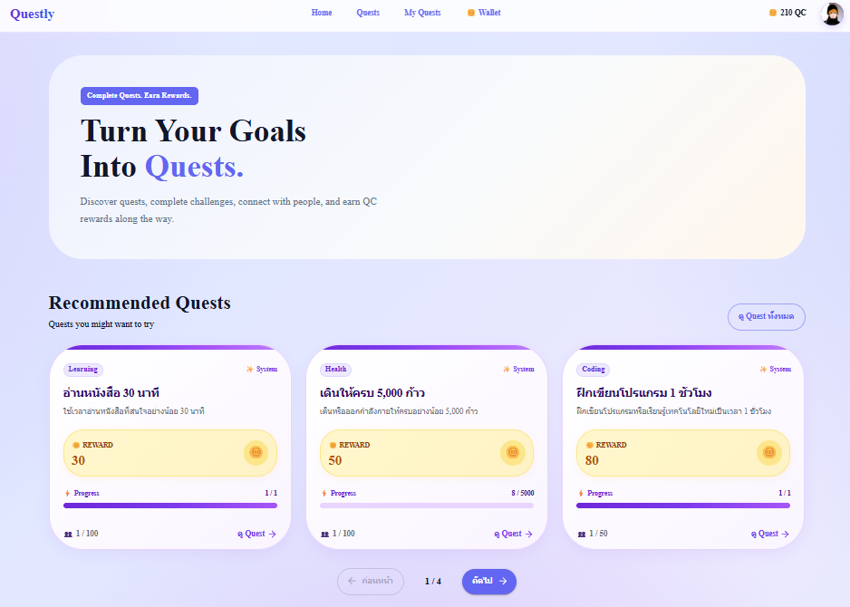

### Mobile

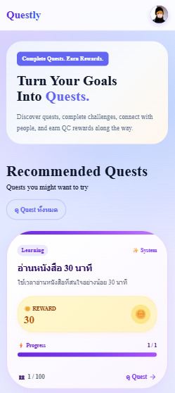

---

# 🖼️ Screenshots

ส่วนนี้ให้เพิ่มภาพหน้าจอจริงของระบบก่อนส่งอาจารย์

## Home

* Desktop
* Mobile

## Quests

* Quest List
* Search

## Quest Detail

* Quest Detail
* Accept Quest
* Todo
* Completed
* Claim Reward

## Create Quest

* Create Quest Form

## My Quests

* In Progress
* Completed
* Rewarded

## Wallet

* QC Balance
* Transaction History

## Profile

* Profile
* Edit Name
* Updated Avatar

---

# 🛠️ Technology Stack

| Technology   | รายละเอียด                              |
| ------------ | -------------------------------------  |
| Next.js      | Framework สำหรับพัฒนา Web Application   |
| React        | Library สำหรับสร้าง UI                   |
| TypeScript   | จัดการ Type ของข้อมูล                     |
| Material UI  | UI Component และ Responsive Design     |
| React Hooks  | จัดการ State และ Lifecycle              |
| LocalStorage | จัดเก็บข้อมูลฝั่ง Browser                    |
| App Router   | จัดการ Routing                           |

---

# 🚀 Installation

Clone โปรเจกต์แล้วติดตั้ง Package

```bash
npm install
```

---

# ▶️ Run Project

```bash
npm run dev
```

จากนั้นเปิด

```text
http://localhost:3000
```

---

# 🧪 การทดสอบระบบ

## Test 1 — เปิดหน้า Home

```text
เปิดเว็บไซต์
→ Home
→ แสดง Recommended Quest
```

## Test 2 — ค้นหา Quest

```text
Quests
→ Search
→ เลือก Quest
→ Quest Detail
```

## Test 3 — รับ Quest

```text
Quest Detail
→ Accept
→ In Progress
```

## Test 4 — ทำ Quest

```text
In Progress
→ ทำ Todo
→ Progress เพิ่ม
→ Todo ครบ
→ Completed
```

## Test 5 — Claim Reward

```text
Completed
→ Claim Reward
→ QC เพิ่ม
→ Transaction ถูกบันทึก
→ Rewarded
```

## Test 6 — Profile

```text
Profile
→ Edit Name
→ Save
→ ชื่อเปลี่ยน
→ Avatar เปลี่ยนตามชื่อ
```

---

# ⚠️ ข้อจำกัดของระบบปัจจุบัน

Questly ในเวอร์ชันปัจจุบันเป็น Web Application Prototype ที่เน้นการพัฒนา Frontend และจำลองระบบ Backend ด้วย LocalStorage

ดังนั้นยังมีข้อจำกัด ได้แก่

* ข้อมูลอยู่ใน Browser ของผู้ใช้
* ไม่มี Database Server
* ไม่มี API Backend จริง
* ไม่มีระบบ Authentication จริง
* ข้อมูลยังไม่สามารถ Synchronize ระหว่างอุปกรณ์
* QC ยังไม่ได้มีระบบ Blockchain หรือระบบเงินดิจิทัลจริง
* ระบบหัก QC จากเจ้าของ Quest ยังไม่ได้พัฒนา

---

# 🔮 แนวทางการพัฒนาต่อ

ในอนาคตสามารถพัฒนาระบบเพิ่มเติมได้ เช่น

1. เพิ่ม Login / Register
2. เพิ่ม Database เช่น MySQL หรือ PostgreSQL
3. สร้าง Backend API
4. เพิ่มระบบ Authentication
5. เพิ่มระบบ Admin
6. เพิ่มระบบ Notification
7. เพิ่มระบบ Chat
8. เพิ่มระบบ Follow / Social
9. เพิ่มระบบหัก QC จากผู้สร้าง Quest
10. เพิ่มระบบ Escrow สำหรับล็อก Reward
11. เพิ่มระบบ Transaction ที่ปลอดภัย
12. เพิ่มระบบ Cloud Storage
13. Deploy ระบบให้ใช้งานจริง

---

# 👥 สมาชิกกลุ่ม

นาย จักรพงศ์ สำราญสิทธิ์ 673450032-2
นาย กิตติศักดิ์ ขันแข็ง 673450031-4
นาย พุทธิพงษ์ งามจัตุรัส 673450038-0

---

# 📚 สรุป

Questly เป็น Web Application ที่นำแนวคิดเกี่ยวกับ Quest และ Reward มาประยุกต์ใช้ในการสร้างระบบสำหรับการสร้างและเข้าร่วมภารกิจ

ระบบสามารถจัดการ Quest ตั้งแต่การสร้าง Quest การรับ Quest การทำ Todo การติดตาม Progress การทำ Quest สำเร็จ และการรับ QC Reward รวมถึงมีระบบ Wallet และ Profile

การพัฒนาระบบใช้ Next.js, React, TypeScript และ Material UI พร้อมนำ React Hooks และ Custom Hook มาใช้ในการจัดการข้อมูลและ State ของระบบ

ระบบปัจจุบันใช้ LocalStorage เพื่อจำลองการจัดเก็บข้อมูล ทำให้สามารถพัฒนาและทดสอบ Flow หลักของระบบได้โดยไม่จำเป็นต้องมี Backend Server

ในอนาคตสามารถต่อยอดไปสู่ระบบที่มี Database, Authentication, Backend API และระบบ QC แบบเต็มรูปแบบได้

---

# 📌 สถานะโครงงานโดยสรุป

```text
Frontend                  ✅ เสร็จ
Next.js                   ✅ ใช้งาน
React                     ✅ ใช้งาน
TypeScript                ✅ ใช้งาน
Material UI               ✅ ใช้งาน
Responsive                ✅ รองรับ
Quest System              ✅ มี
Todo System               ✅ มี
Progress System           ✅ มี
Reward System             ✅ มี
QC Wallet                 ✅ มี
Transaction               ✅ มี
Profile                   ✅ มี
Custom Hooks              ✅ มี
LocalStorage              ✅ มี

Database                  ❌ ยังไม่มี
Backend API               ❌ ยังไม่มี
Login / Register          ❌ ยังไม่มี
Admin System              ❌ ยังไม่มี
QC Escrow                 ❌ ยังไม่มี
QC หักจากผู้สร้าง Quest   ❌ ยังไม่มี
```

> **หมายเหตุ:** README ฉบับนี้จัดทำโดยอ้างอิงจากฟังก์ชันที่มีอยู่ในระบบปัจจุบัน เพื่อให้รายละเอียดในเอกสารสอดคล้องกับการทำงานของโปรเจกต์จริง
